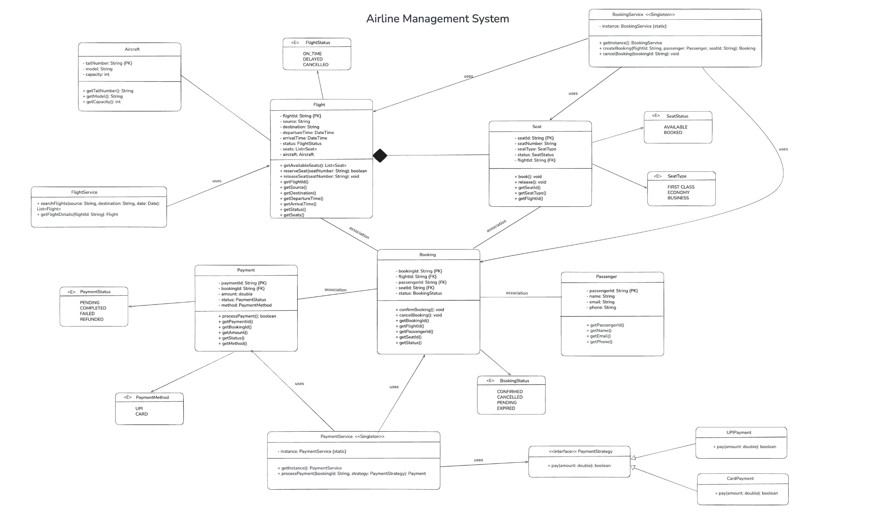

# ✈️ Hawai Airline Management System

[]

## 📌 Project Overview

Hawai is a **full-stack** Airline Management System managing flight search, seat selection, bookings, payments, and cancellations. Built with **TypeScript**, **Prisma/PostgreSQL**, **React/Vite/Tailwind** following OOP, design patterns, and SOLID principles.

## 🎯 Problem & Solution

Efficiently manage airline ops with modularity:
- **Issues addressed**: Separation of concerns via layers (routes → services → models → DB)
- **Approach**: Domain-driven design with Singletons, Strategy, Repository patterns.

## ⚙️ Tech Stack (Accurate)

- **Backend**: Node.js, Express, TypeScript, **Prisma (PostgreSQL/SQLite dev)**, JWT/Bcrypt, Zod
- **Frontend**: **React 19**, TypeScript, **Vite**, **Tailwind CSS**, React Router
- **Database**: **PostgreSQL** (prod), SQLite (dev)
- **Tools**: Prisma Studio, TSX

## 🏗️ System Architecture

```
Frontend (React pages/services)
↓ REST API (Express routes)
↓ Services (Singletons/Repos)
↓ Domain Models (classes)
↓ Prisma → PostgreSQL/SQLite
```

## 📂 Project Structure (Actual)

```
Hawai/
├── backend/
│   ├── prisma/schema.prisma
│   ├── src/models/     # Domain classes
│   ├── src/services/   # Singletons (business logic)
│   ├── src/routes/     # API controllers
│   └── src/middleware/ # Auth
├── frontend/src/
│   ├── pages/          # Home, Flights, Booking, etc.
│   ├── components/
│   └── services/
├── diagram/            # Class,Sequence,ER and Use-case diagram
└── README.md
```

## 🚀 Features

- ✅ Auth (signup/login)
- ✅ Flight search/details
- ✅ Seat booking (atomic tx)
- ✅ Payments (Strategy)
- ✅ My bookings/cancel

## 🧠 OOP Concepts

- **Encapsulation**: Private props in models (Flight, Booking).
- **Abstraction**: Services hide Prisma details.
- **Polymorphism**: Strategy impls (UPIPayment/CardPayment).
- **Composition**: Over inheritance.

## 🧩 Design Patterns

1. **Singleton** (Primary):
   - `FlightService`, `BookingService`, etc.: `private static instance`, `getInstance()`.
   - Centralizes services.

2. **Strategy**:
   - `PaymentStrategy` interface → `UPIPayment`/`CardPayment`.

3. **Repository**:
   - Services: CRUD + DB-to-model mapping.


## 🧱 SOLID Applied

- **S**: Single resp. (BookingService → bookings only).
- **O**: Extend payments w/o changes.
- **L**: Strategies interchangeable.
- **I**: Focused interfaces.
- **D**: Depend on models/services.

## 📋 API Endpoints

| Method | Endpoint       | Protected |
|--------|----------------|-----------|
| POST   | `/api/auth/*`  | No        |
| GET    | `/api/flights`| No        |
| POST   | `/api/bookings`| Yes       |
| POST   | `/api/payments`| Yes       |

## 🔧 Setup & Run

**Prerequisites**: Node ≥20, PostgreSQL (opt).

### Backend
```bash
cd backend
npm i
# .env: DATABASE_URL="file:./dev.db", JWT_SECRET="..."
npx prisma generate
npx prisma migrate dev
npm run dev  # :3000
```

### Frontend
```bash
cd frontend && npm i && npm run dev  # :5173
```

## 🧪 Testing

- TS: `npm run typecheck`
- API: `backend/api-tests.http`

## 📊 Schema

Models: Passenger → Booking → Seat/Flight/Aircraft/Payment.

## 📈 Future

- Stripe integration
- More tests/diagrams
- Docker deploy

## 📌 Conclusion

Accurate showcase of patterns/principles in real full-stack TypeScript app. Corrected from proposal: actual tech/structure/patterns/setup.

